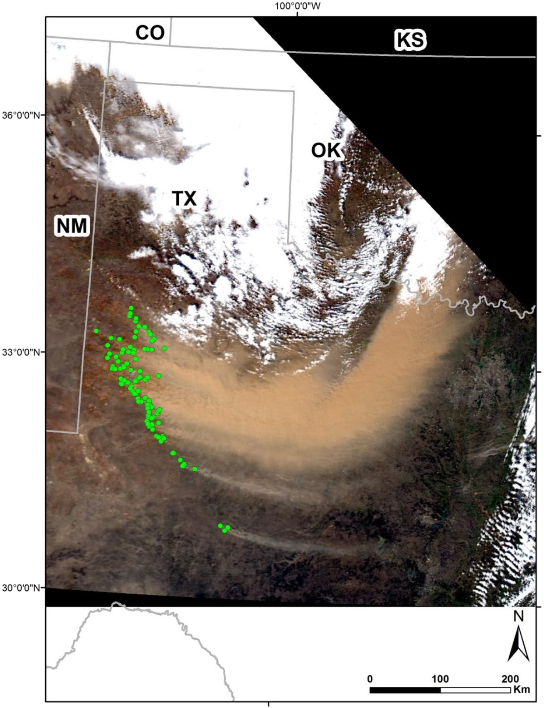

```{r, message = FALSE, warning = FALSE, echo = FALSE}
library(tidyverse)

# 3.3 Packages
library(readxl)
library(tabulizer)
library(pmetar)
library(riem)
```

# Links from Nick

* Work with MODIS in R: https://www.earthdatascience.org/courses/earth-analytics/multispectral-remote-sensing-modis/modis-data-in-R
* `MODIS` package in R: https://cran.r-project.org/web/packages/MODIS/MODIS.pdf


# Links from the paper
* Tarek Kandakji OrcID: https://orcid.org/0000-0001-9173-5747
* Blowing dust paper: https://www.sciencedirect.com/science/article/pii/S0048969717328334?via%3Dihub
* Drought level and land use on dust: https://www.essoar.org/doi/10.1002/essoar.10500387.1
* 2021 paper: https://www.sciencedirect.com/science/article/pii/S0048969720359908
  
* The original paper: https://www.sciencedirect.com/science/article/pii/S0169555X19305100
* This file contains the location of the detected dust point sources: https://data.mendeley.com/datasets/6f8nyyr6n9/1

\newpage
# Figures
<!--  --->





\newpage
# Tables

## Table 1. Weather stations used in the study.

```{r, message = FALSE, warning = FALSE}
# Suppress code because this:
# The mutate contains str_replace(.$"Long., Lat.", "−", 
# last of which is an unprintable character (Unicode minus)
table_1 <- readxl::read_excel("Figures/Table-1.xlsx")

table_1 <- table_1 %>%
  rename(LongLat = 'Long., Lat.') %>% 
  mutate(LongLat = str_replace(LongLat, "−", "-")) %>%
  extract(col = "Station name (station code)", 
          into = c("Station_name", "Station_code"), 
          regex = "(.+) \\((.+)\\)", remove = TRUE) %>%
  separate(col = LongLat, into = c("Longitude", "Latitude"),
         sep = ", ", remove = TRUE, convert = TRUE)

# Store the dates for the earliest available in 2001-16 at each site. (As of 2021-02-18)
first_avail <- c("2007-01-26", "2001-01-01", "2001-01-01", "2001-01-01", "2001-01-01", 
                 "2001-01-01", "2005-06-01", "2001-01-02", "2014-11-06", "2001-01-01",
                 "2001-01-01", "2001-01-01", "2001-01-01", "2001-01-01", "2001-01-01")
table_1 <- cbind(table_1, first_avail)

rm(first_avail)

## Write final table to CSV for later loading
write.csv(table_1, file = "Data/table_1_cleaned.csv", 
          row.names = FALSE)
```

```{r, message = FALSE, warning = FALSE}
table_1
```

\newpage
## Table 2. Summary of MODIS products used in the study.

```{r, message = FALSE, warning = FALSE}
table_2 <- readxl::read_excel("Figures/Table-2.xlsx")

table_2 <- table_2 %>%
  na_if(., "N/A") %>%
  separate(col = "MODIS product",
           into = c("MODIS_Terra_product", "MODIS_Aqua_product"),
           sep = " & ", remove = TRUE) %>%
  extract(col = "Bands", into = c("Band_number", "Band_name"),
           regex = "Band ([[:digit:]]+) \\((.+)\\)", remove = TRUE)

## Write final table to CSV for later loading
write.csv(table_2, file = "Data/table_2_cleaned.csv", 
          row.names = FALSE)
```

```{r, message = FALSE, warning = FALSE}
table_2
```

\newpage
## Table 3. Summary of dust emission analysis by geomorphic class.

```{r, message = FALSE, warning = FALSE}
table_3 <- readxl::read_excel("Figures/Table-3.xlsx")

table_3 <- table_3 %>% 
  setNames(c("Geomorphology_class", "Area_km2", "Area_pct",
            "Dust_src_pts_n", "Dust_src_pts_pct",
            "Dust_Emission_Ratio_DER")) %>%
  na_if(., "-") %>%
  mutate(Subregion = ifelse(is.na(Geomorphology_class), 
                            Geomorphology_class[-1],"Study Area")) %>%
  relocate(Subregion , .after = Geomorphology_class) %>% 
  filter(!(Geomorphology_class %in% 
             c("Great Plains", "Southern High Plains", "Chihuahuan Desert"))) %>% 
  fill(Geomorphology_class, .direction = "down") %>%
  mutate(Area_pct = ifelse( Area_pct == "1.1000000000000001", "1.1", Area_pct)) %>%
  mutate(Area_pct = ifelse( Area_pct == "<0.1", "0", Area_pct)) %>%
  mutate(Area_pct = as.numeric(Area_pct)) %>%
  mutate(DER_comp = ifelse(Dust_src_pts_pct == 0, 0, Dust_src_pts_pct / Area_pct)) %>%
  mutate(DER_comp = ifelse(Subregion == "Study Area", NA, DER_comp))

## Write final table to CSV for later loading
write.csv(table_3, file = "Data/table_3_cleaned.csv", 
          row.names = FALSE)
```

```{r, message = FALSE, warning = FALSE}
table_3
```

\newpage
## Table 4. Summary of dust emission analysis by land cover type.

```{r, message = FALSE, warning = FALSE}
table_4 <- readxl::read_excel("Figures/Table-4.xlsx")

table_4 <- table_4 %>% 
  setNames(c("Land_cover_type", "Area_km2", "Area_pct",
            "Dust_src_pts_n", "Dust_src_pts_pct",
            "Dust_Emission_Ratio_DER")) %>%
  na_if(., "-") %>%
  mutate(Subregion = ifelse(is.na(Land_cover_type), 
                            Land_cover_type[-1],"Study Area")) %>%
  relocate(Subregion , .after = Land_cover_type) %>% 
  filter(!(Land_cover_type %in% 
             c("Great Plains", "Southern High Plains", "Chihuahuan Desert"))) %>% 
  fill(Land_cover_type, .direction = "down") %>%
  mutate(Area_pct = ifelse( Area_pct == "2.2000000000000002", "2.2", Area_pct)) %>%
  mutate(Area_pct = ifelse( Area_pct == "20.399999999999999", "20.4", Area_pct)) %>%
  mutate(Area_pct = ifelse( Area_pct == "<0.1", "0", Area_pct)) %>%
  mutate(Area_pct = as.numeric(Area_pct)) %>%
  mutate(DER_comp = ifelse(Dust_src_pts_pct == 0, 0, Dust_src_pts_pct / Area_pct)) %>%
  mutate(DER_comp = ifelse(Area_pct == 0, NA, Dust_src_pts_pct / Area_pct)) %>%
  mutate(DER_comp = ifelse(Subregion == "Study Area", NA, DER_comp))

## Write final table to CSV for later loading
write.csv(table_4, file = "Data/table_4_cleaned.csv", 
          row.names = FALSE)
```

```{r, message = FALSE, warning = FALSE}
table_4
```

# Methodology

**COMMENT:** I think the order might have been 3.3 -> -> 3.4 -> 3.5 -> 3.1 -> 3.2, with the study area defined after they identified dust sources. The jagged borders of the black Study Area in Figure 1 seem to indicate this. Doing 3.3 first makes the most sense.

## 3.1 Land-cover map

"The data for the land-cover map (Fig. 2) were obtained from the National Land Cover Database (Homer et al., 2015) via their website: https://mrlc.gov. Maps for 2011 were used in this study."

## 3.2 Geomorphology
"A geomorphology map (Fig. 3) was created according to the dust source geomorphic classification adopted by Bullard et al. (2011). The classification was applied to a soil base map obtained from the USA Gridded Soil Survey Geographic (gSSURGO) Database State-tile Package (https://gdg.sc.egov.usda.gov/GDGOrder.aspx?order=QuickState)."

"The adjoining common polygons across each state's borders were unified. Based on the geomorphological information provided by the soil map, a geomorphic class from Bullard et al. (2011) was assigned to that polygon. The borders of the study area, however, were determined after the dust points were identified. The continuous outline of all polygons that included at least one dust point determined the border of the domain as shown in Fig. 1."

## 3.3 Weather data collection
"Weather data were collected from 15 meteorological stations located in five states: Colorado, Kansas, New Mexico, Oklahoma, and Texas, as were also used by Li et al. (2018) (Table 1). The data were obtained for the years 2011 to 2016 (https://mesonet.agron.iastate.edu/request/download.phtml)."

We can use the package `pmetar` in R to download and parse current METAR reports. Note that `pmetar::metar_get` is able to download multiple codes at once through an input vector, and codes are not case sensitive. We can also use the package `riem` to get data. `pmetar` was published 2021-01-13 so it is brand spanking new, while `riem` was published 2016-09-10.

```{r, message = FALSE, warning = FALSE}
# Print the most recent weather for all station codes in Table 1.
pmetar::metar_get(table_1$Station_code)

# Get the location information for stations in Table 1
pmetar::metar_location(table_1$Station_code)
```

Interesting. Note that a *K* is prepended to all three-letter station codes in my list, since *K* was given to contiguous US by ICAO.

```{r, message = FALSE, warning = FALSE}
# LAA says start is 1994-12-31 18:00:00-06 per
#     https://mesonet.agron.iastate.edu/sites/networks.php?network=CO_ASOS&format=html
# The below are Oklahoma stations
#     https://mesonet.agron.iastate.edu/sites/networks.php?network=OK_ASOS&format=html
# LTS in the same tool says 2001-01-01 missing but ok after
# AXS has a first date 2005-06-01 
# ELK has a first date 2014-11-06 08:15:00-06

paste0("METAR_", table_1$Station_code[-c(1,7:9)])

for(i in table_1$Station_code[-c(1,7:9)]){
   assign(paste0("METAR_", i),
          do.call(pmetar::metar_get_historical,
                  list(i, start_date = "2001-01-01",
                       end_date = "2001-01-31", 
                       from = "iastate")) )
}

# Lubbock is# Lubbock is in West Texas, where many dust sources are, and can be 
METAR_LBB <- pmetar::metar_get_historical("LBB", 
                             start_date = "2001-01-01", 
                             end_date = "2016-12-31",
                             from = "iastate")

metar_dust_abbrev <- c("DS", "DU", "BLDU", "DRSA", "DS", "PO", "SA", "SS",
                       "VCBLDU", "VCDS", "VCPO", "VCSS")

sum(grepl(c("BLDU| DU"), METAR_LBB)) / length(METAR_LBB)

# This is a BLDU event that would get missed by `pmetar` because it ignores the remarks.
"200103151753 METAR METAR KLBB 151753Z 33030G39KT 9SM CLR 12/M06 A2993 RMK AO2 PK WND 33041/1741 SLP117 BLDU ALQDS T01171061 10117 20017 53010"      

metar_wx_codes("200103151753 METAR METAR KLBB 151753Z 33030G39KT 9SM CLR 12/M06 A2993 RMK AO2 PK WND 33041/1741 SLP117 BLDU ALQDS T01171061 10117 20017 53010"      )

#Let's try to use `riem` to investigate the same date range and see what their functions do.
# NOTE: date_end should be the day AFTER the last day on which you want observations
# DOCUMENTATION IS AT https://docs.ropensci.org/riem/reference/riem_measures.html

METAR_KLBB <- riem::riem_measures(station = "KLBB", date_start = "2001-01-01", date_end = "2017-01-01")
METAR_KLBB_03_15 <- METAR_KLBB %>% 
  filter(grepl("2001-03-15", as.character(valid)))

View(METAR_KLBB_03_15[18:22,c("wxcodes", "metar")])# Rows showing discrepancy

METAR_KLBB %>% filter(grepl("2016-12-31", as.character(valid)))

METAR_KLBB[,c("valid", "vsby", "wxcodes", "metar")] %>% filter(grepl("BLDU", wxcodes))
```

"Dusty days were determined following the procedure by Lee et al. (2012). A dust event was recorded if the visibility in one or more stations was less than 3 mi (~5km) for at least 1 h and the present weather code was indicating dust, or the weather code was dust for a minimum of 2h regardless of visibility."

```{r, message = FALSE, warning = FALSE}
# Key functions

# pmetar::metar_visibility(CHAR, metric = FALSE) # Visibility in miles
# We can read the visibility from a single report, metric = FALSE gives miles.

# pmetar::metar_wx_codes() doesn't do quite what we want

```

"The METAR present weather codes (https://www.weather.gov/media/wrh/mesowest/metar_decode_key.pdf) that were considered as dust are: DS, DU, BLDU, DRSA, DS, PO, SA, SS, VCBLDU, VCDS, VCPO, and VCSS. Using the 3 mi visibility criterion or the 2 h dust reporting increase the probability that blowing dust is dense enough to be detected by the satellite imagery (Mahowald et al., 2003; She et al., 2018)"

Note that a subset of these codes are already stored (with additional information) in `pmetar::metarWXcodes`.

Alright, some of the explanation of what METAR data looks like is at https://en.wikipedia.org/wiki/METAR (METAR stands for Meteorological Aerodrome Report) too, as well as in the KEY TO DECODE AN ASOS OBSERVATION at the end of the following PDF.

```{r, message = FALSE, warning = FALSE}
# METAR/TAF LIST OF ABBREVIATIONS AND ACRONYMS - Reading the PDF into R
# Only the first 3 pages contain our abbreviations.
# The last 2 pages contain a "KEY TO DECODE AN ASOS (METAR) OBSERVATION"
# which might be of use later on.

# Use tabulizer::locate_areas() to get graphical location of desired columns.
# areas are specified a2 <- list(c(126, 149, 212, 462), c(126, 284, 174, 417))
# in this case for multiple pages.
# You can replace filename w/link
# https://www.weather.gov/media/wrh/mesowest/metar_decode_key.pdf

# You can use locate_areas to determine corners. Output is a list of vectors.
# out <- tabulizer::locate_areas("Figures/metar_decode_key.pdf", c(1, 1, 2, 2, 3, 3))

## Save the corner points in a list
corners <- list(c(top = 0, left = 0, bottom = 1000, right = 1000), #p1
                c(top = 50, left = 390, bottom = 761, right = 770), #p1
                c(top = 16, left = 6, bottom = 776, right = 320), #p2
                c(top = 16, left = 390, bottom  = 776, right = 770), #p2
                c(top = 16, left = 6, bottom = 486, right = 390), #p3
                c(top = 16, left = 390, bottom = 486, right = 770)) #p3

# Use tabulizer::extract_tables to pull tables from the PDF
out <-tabulizer::extract_tables(file = "Data/metar_decode_key.pdf", 
                                pages = c(1,1,2,2,3,3),
                                area = corners[1:6],
                                method = "lattice")
## Page 1
out[[1]] <- out[[1]][-1,]
out[[1]][1, 1:2] <- out[[1]][1, 2:3]

sec_1 <- as.data.frame(out[[1]][-22,1:2]) %>%
  setNames(c("Abbrev", "Def"))

sec_2 <- as.data.frame(out[[2]][-28,]) %>%
  setNames(c("Abbrev", "Def"))

## Page 2
out[[3]][1,1:2] <- out[[3]][1,3:4]

sec_3 <- as.data.frame(out[[3]][,1:2]) %>%
  setNames(c("Abbrev", "Def"))

sec_4 <- as.data.frame(out[[4]]) %>%
  setNames(c("Abbrev", "Def"))

## Page 3
sec_5 <- as.data.frame(out[[5]][,1:2]) %>%
  setNames(c("Abbrev", "Def"))

sec_6 <- as.data.frame(out[[6]]) %>%
  setNames(c("Abbrev", "Def"))

## Combining sections into a single data frame
metar_abbrev <- rbind(as.name(paste0("sec_", 1:6)))

metar_abbrev <- do.call(rbind, lapply( paste0("sec_", 1:6) , get)) %>%
  arrange(Abbrev)

## Write final table to CSV for later loading
write.csv(metar_abbrev, file = "Data/METAR-Abbreviations.csv", 
          row.names = FALSE)

## Clean up input files, leaving data.frames only
rm(list = c("corners", "out", grep("sec_", ls(), value = TRUE)))

# Note authors say 4 char abbrev that are 2x2 char in table
# "BLDU" but this is "BL" and "DU",
# "DRSA" is "DR" and "SA", and "VC" is a prefix for "in the vicinity"

metar_dust_abbrev <- c("DS", "DU", "BLDU", "DRSA", "DS", "PO", "SA", "SS",
                       "VCBLDU", "VCDS", "VCPO", "VCSS")

metar_dust_df <- metar_abbrev %>%
  filter(Abbrev %in% c("DS", "DU", "BL", "DU", "DR", "SA", "DS", "PO", "SA", "SS",
                       "VC", "BL", "DU", "VC", "DS", "VC", "PO", "VC", "SS") )
```


## 3.4 MODIS data collection

"MODIS true color images were obtained from the University of Wisconsin Space Science and Engineering Center (SSEC) (http://ge.ssec.wisc.edu/modis-today/) and were examined visually prior to any analysis to detect visibility of dust plumes. Corrected MODIS true color images with 250 m spatial resolution were used. The website, however, has data available for dates after October 23, 2007. Moreover, some days after that date are missing from the website and not available. Subsequently, MODIS true color image for the missing dates were examined through the Level-1 and Atmosphere Archive & Distribution System (LAADS) Distributed Active Archive Center (DAAC) website (https://ladsweb.modaps.eosdis.nasa.gov/search/). For the missing days, true color images were created using the visible bands included in MODIS products MOD09GA and MYDO9GA, also obtained from LAADS."

"For each dusty day reported, the MODIS true color image for that day was examined to determine its suitability for analysis. Accordingly, if the image contained clouds over the dust source region and/or the dust plumes were identifiable, then that day was considered not suitable for image processing and thus excluded from the analysis (Lee et al., 2012)."

"After determining which dusty days had MODIS images suitable for analysis, certain MODIS products for that day were downloaded from the LAADS website. The products included are summarized in Table 2."

## 3.5 Image Processing

### 3.5.1 Producing MODIS true color images
### 3.5.2 Processing MODIS thermal bands

## 3.6 Identifying dust point sources

## 3.7 Calculating Dust Emission Ratio

## 3.8 Cluster analysis